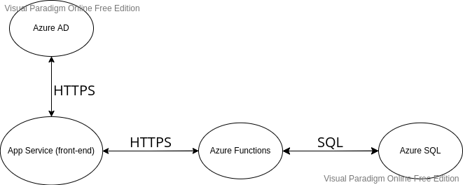

# Projekt "Podstawy tworzenia aplikacji w oparciu o usługi Azure (Relativity) "

Ten projekt został stworzony na przedmiot "Podstawy tworzenia aplikacji w oparciu o usługi Azure (Relativity)". 
W tym dokumencie przedstawione zostaną funkcjonalności dostarczane przez projekt oraz infrastruktura rozwiązania 
ze szczególnym naciskiem na wykorzystane komponenty chmury Microsoft Azure. 

## Opis rozwiązania
Stworzone rozwiązanie to bardzo uproszczony sklep internetowy pozwalający użytkownikom na składanie zamówień 
oraz przeglądanie już złożonych. 
Lista wszystkich dostępnych zamówień jest dostępna dla anonimowych użytkowników, ale aby składać i przeglądać zamówienia 
wymagane jest zalogowanie się do systemu. Logowanie odbywa się za pomocą konta Microsoft, więc nie trzeba pamiętać 
dodatkowego hasła. Nawigacja w aplikacji odbywa się za pomocą górnej belki, na której znajdują się odnośniki do strony głównej (Relativity Project),
oraz listy złożonych zamówień (Orders). Na głównej belce znajduje się również koszyk zakupowy oraz przycisk do logowania i
wylogowywania z aplikacji. 

## Architektura rozwiązania
Rozwiązanie zostało wdrożone w chmurze Microsoft Azure i składa się z kilku komunikujących się ze sobą pomniejszych komponentów:
- Angular SPA front-end (Azure App Service for Node + Application Insights)
- .NET serverless (Azure Functions + Application Insights)
- SQL database (Azure SQL)
- Identity provider (Azure AD)

## Diagram połączeń pomiędzy komponentami

